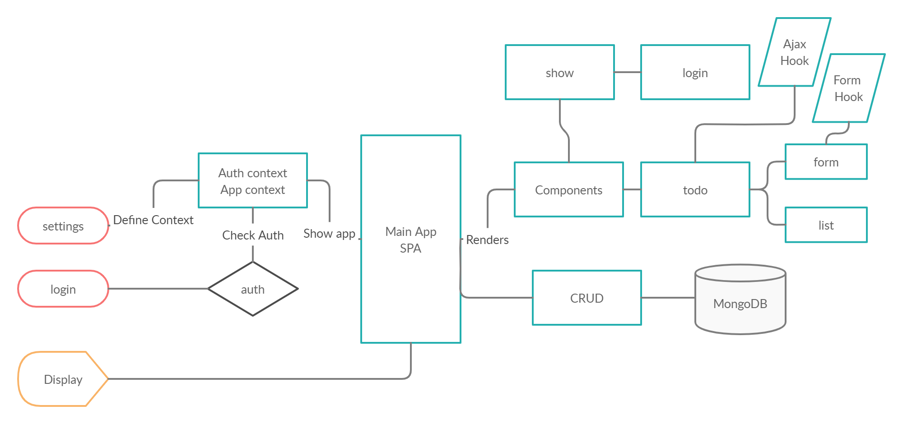

# todo App
Begin the build of an application designed for creating and organizing a “To Do” list in your browser.

Author: Yahya Abu Khalil
**Version**: 1.0.0 

## Overview
A todo app that everyone knows and loves, stored in mongoose, fetched, displayed, and manipulated using a react frontend.

## Getting Started
These instructions will get you a copy of the project up and running on your local machine for development and testing purposes. See deployment for notes on how to deploy the project on a live system.

## Prerequisites

- Operating system: Mac OS, Windows, Linux
- Git
  Follow the instruction in the links below to install git in your machine
  - [Windows](https://git-scm.com/download/win)
  - [Mac OS](https://git-scm.com/download/mac)
  - [Linux](https://git-scm.com/download/linux)
- [Codeing Editor](https://www.wpbeginner.com/showcase/12-best-code-editors-for-mac-and-windows-for-editing-wordpress-files/)

## Installation

1. Open your terminal

2. Clone the repo with `git clone https://github.com/AbuKhalil95/todo`

3. Run the following commands to enjoy the app:
  - `cd todo`
  - `npm i`
  - `npm start`
  - enjoy the app.

## Architecture
This application was build with react.js javaScript framework and it includes:
- create-react-app to setup the app.
- react bootstrap for styling.
- functional apps, with hooks and context to manage states and updating components.
- basic mongoose backend to handle storage and authentication.
- Auth with jwt and its dependencies.
- various other dependencies and 3rd party hooks (axios, forms, etc..) to accelerate development.

# UML diagram

